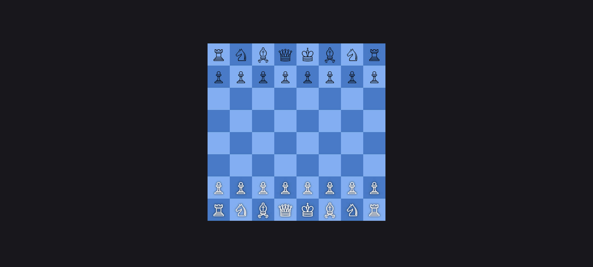
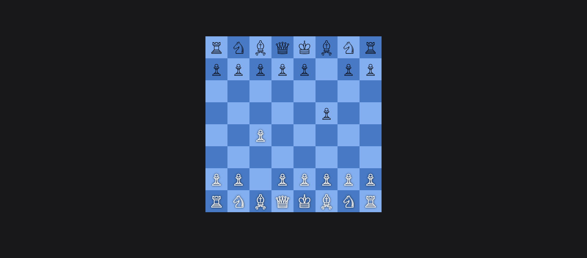
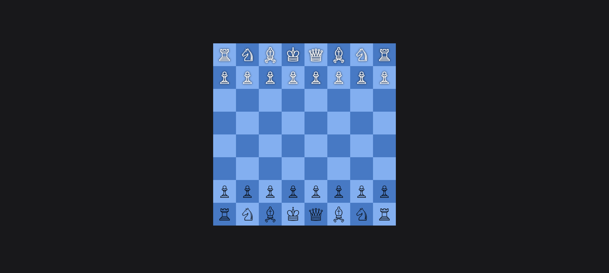
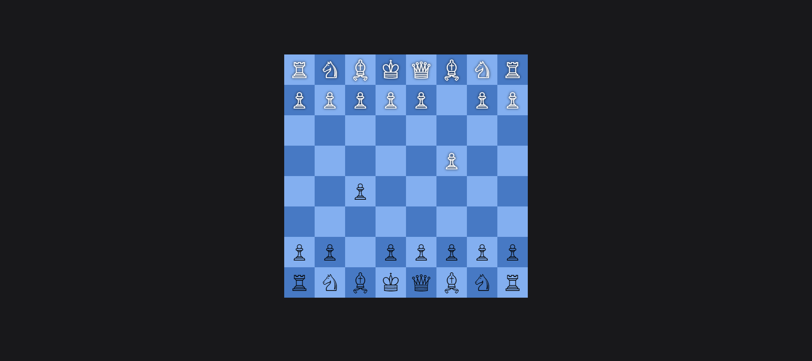

# Chess

Welcome to Chess project! Chess for Two is a multiplayer chess game that allows two players to play chess against each other over the network. This server handles game logic, player connections, and game state management.

## Description

This project aims to provide a seamless and enjoyable experience for chess enthusiasts who want to play against each other remotely. With a focus on simplicity and reliability, Chess for Two makes it easy to start a game with a friend or challenge someone new.

## Features

- Two-Player Matches: Play against another person in real-time.
- Move Validation: Ensures all moves are legal according to standard chess rules.
- Game State Persistence: Keeps track of the game state, even if players disconnect and reconnect.
- Restful API: Simple and intuitive API for interacting with the game server.

## Technologies Used

- **Frontend**: HTML, CSS, JavaScript
- **Backend**: Node.js, Express.js

## Screenshots

To provide a better understanding of Chess application, here is a screenshot:

##User1 Interface

##User2 Interface

Feel free to customize this template according to your project's specific needs and details!

For any inquiries, please contact:

Name: Gauranshi Varshney
Email: gauranshivarshney@gmail.com
